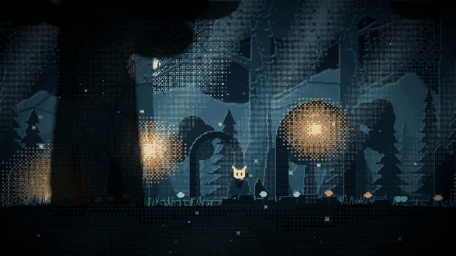
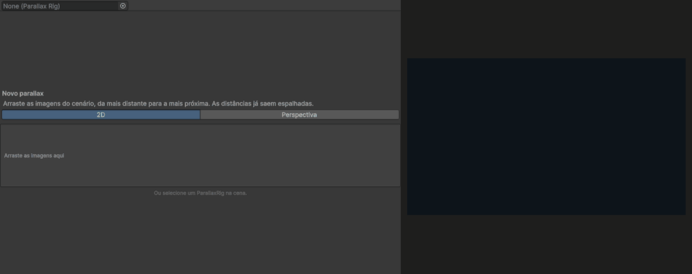
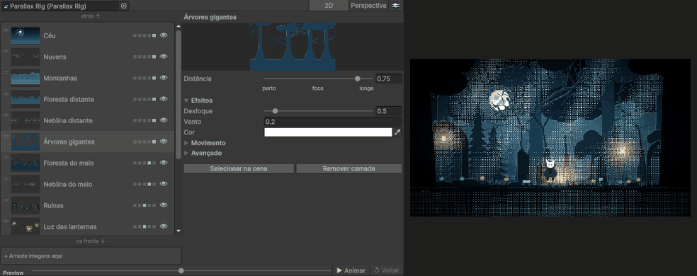

# Paralaxe

Pacote para a Unity que monta cenários com parallax em camadas, direto no editor, sem escrever código para cada camada. Serve para jogos 2D, em dois modos: um parallax simulado, com um fator de movimento por camada, e um em perspectiva, em que cada camada tem uma profundidade de verdade.

Veio de uma ferramenta de editor simples e virou um pacote, com um cenário de exemplo em pixel art que mostra o que dá para fazer.

## O editor

Arraste as imagens do cenário para a janela, da mais distante para a mais próxima, e o parallax sai montado, com as distâncias já espalhadas.

Cada camada tem um controle só de distância, de perto a longe. O preview anda com a câmera sem entrar em Play, e trocar entre 2D e perspectiva ajusta a câmera junto.

## Como foi feito

- **Dois modos de cálculo**, simulado em 2D e em perspectiva. O modo segue a câmera: ortográfica usa 2D, em perspectiva usa perspectiva, então os dois nunca ficam desencontrados.
- **Uma janela só para tudo**: lista das camadas com miniatura, detalhes da camada escolhida, valores do mundo e preview com animação. O preview usa cópias temporárias e é desfeito antes de salvar, recompilar ou entrar em Play, então nada dele fica gravado na cena.
- **Valores globais** de velocidade e de vento, que o jogador pode afetar e que também afetam o jogador.
- **Efeitos por camada**: desfoque, brilho aditivo, rolagem automática, influência do vento e repetição horizontal sem emenda.
- **Leve de rodar**: o rig custa cerca de 3 µs por quadro e não aloca memória, e testes de desempenho travam isso. O cenário de exemplo roda a 165 FPS num notebook.
- **Ícones em pixel art** e uma tela de boas-vindas com créditos e atalhos, gerados por script como o resto da arte.
- **Cenário de exemplo** em pixel art, com herói animado, câmera que acompanha na horizontal e na vertical, pássaros, vagalumes, luz e neblina. A arte é gerada por script, o que permite refazer o cenário com outra paleta ou outro bioma.

## Qual modo usar

- **2D**, com câmera ortográfica: cada camada tem um fator de movimento e todas ficam na mesma grade de pixels. É o mais indicado para pixel art, como em Celeste e Dead Cells, e é o modo do cenário de exemplo.
- **Perspectiva**, com câmera em perspectiva: as camadas ficam em profundidades de verdade e o parallax vem da própria câmera, nos dois eixos. É o caminho do Hollow Knight, que usa arte pintada. Em pixel art, a escala muda com a distância e os pixels deixam de ter o mesmo tamanho entre as camadas.

## Tecnologias

- **Pacote:** C# e a API de editor da Unity 6, com o Universal Render Pipeline.
- **Efeitos:** shaders próprios, para o vento e o brilho aditivo.
- **Arte do exemplo e ícones:** Python com PIL, em pixel art.
- **Testes:** Unity Test Framework, com testes de desempenho.

## Licença

O código é livre para usar, inclusive em jogos comerciais, com uma condição: o jogo ou projeto tem que creditar **Paralaxe, por Gustavo Victor** nos créditos, na tela de sobre ou na documentação, com o link do repositório quando der.

A arte do exemplo (imagens, banner, GIFs e os scripts que geram a arte) é só para conhecer o pacote e não pode ser usada em outros projetos. Os detalhes estão em [LICENSE](LICENSE).
