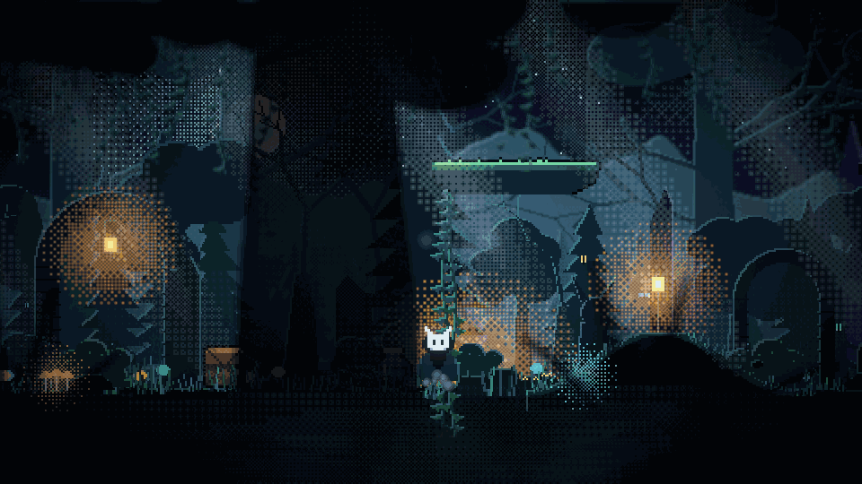
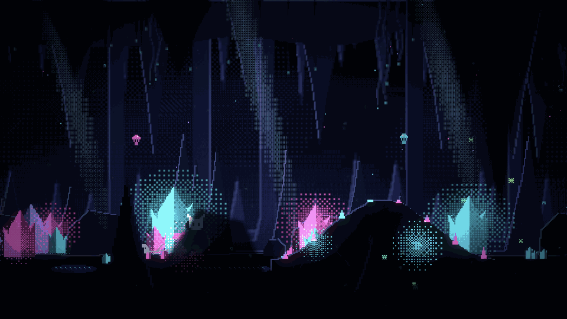
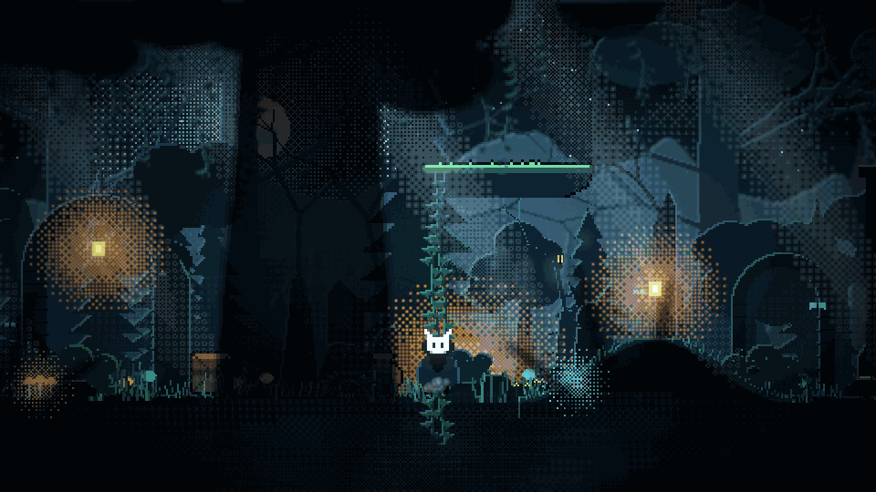
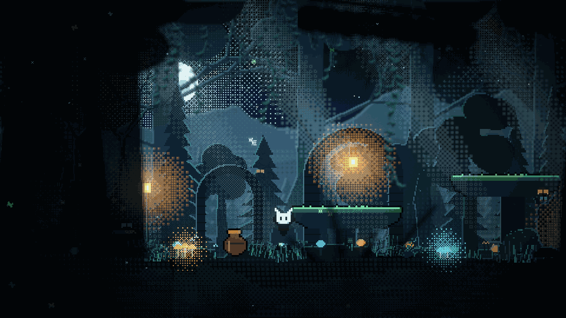
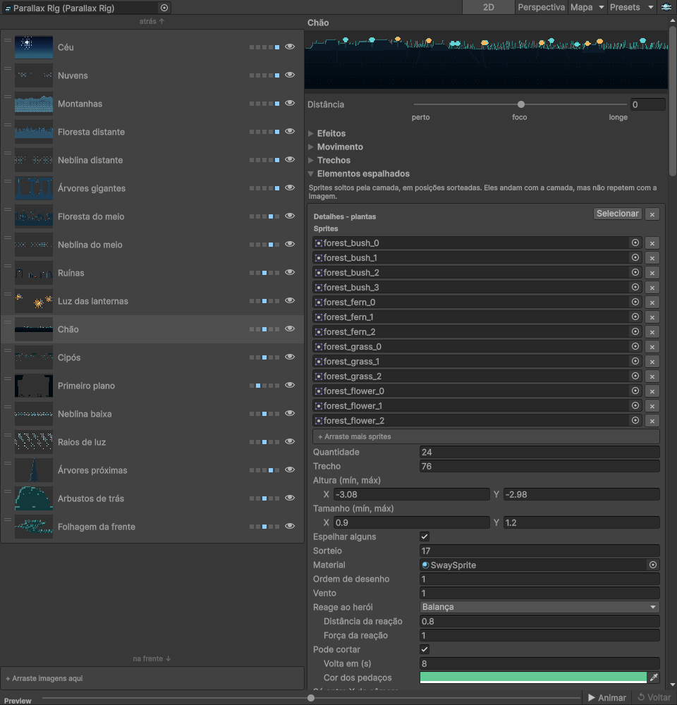

# Paralaxe

Pacote para a Unity que monta cenários com parallax em camadas, direto no editor, sem escrever código para cada camada. Serve para jogos 2D, em dois modos: um parallax simulado, com um fator de movimento por camada, e um em perspectiva, em que cada camada tem uma profundidade de verdade.

Além das camadas, o pacote faz a arte mudar ao longo da fase, espalha elementos sem repetir o mesmo padrão a cada tela, liga cenas por passagens com o fundo continuando de onde parou e traz shaders para vento, balanço, névoa e brilho. Vem com uma jornada de exemplo em pixel art que mostra tudo isso junto.

## A jornada do exemplo

Uma floresta à noite que vira, aos poucos, as ruínas de um templo. A entrada do templo leva a uma caverna de cristal, em outra cena, e o fundo segue de onde a floresta parou. São 18 camadas por bioma, com névoa que forma e desfaz bolsões, raios de luz que cintilam, fogo que tremula, bichos voando em profundidades diferentes, sons e três músicas calmas por bioma.

O terreno tem subidas, degraus e escadaria, e dá para escalar cipós, correntes e raízes até plataformas altas.

O golpe corta o mato e os cipós, que voltam depois de um tempo. Plantas balançam e cogumelos dão um pulinho quando o herói passa, mesmo nas camadas de trás e da frente.

## O editor

Arraste as imagens do cenário para a janela, da mais distante para a mais próxima, e o parallax sai montado, com as distâncias já espalhadas.

Cada camada tem um controle só de distância, de perto a longe. O preview anda com a câmera sem entrar em Play, e trocar entre 2D e perspectiva ajusta a câmera junto.

Cada camada também tem os seus trechos, em que a arte muda ao longo da fase, e os seus elementos espalhados: arraste os sprites e ajuste quantidade, altura, tamanho, vento, se reagem ao herói e se podem ser cortados. O botão Mapa cuida dos limites da câmera, com alças na cena, e das passagens entre cenas.

## Como foi feito

- **Dois modos de cálculo**, simulado em 2D e em perspectiva. O modo segue a câmera: ortográfica usa 2D, em perspectiva usa perspectiva, então os dois nunca ficam desencontrados.
- **Uma janela só para tudo**: lista das camadas com miniatura, detalhes da camada escolhida, valores do mundo, mapa e preview com animação. O preview usa cópias temporárias e é desfeito antes de salvar, recompilar ou entrar em Play, então nada dele fica gravado na cena.
- **Trechos por camada**: a arte muda bloco a bloco fora da tela, com uma costura entre os dois cenários, ou a camada inteira esmaece, para as camadas distantes que quase não andam. Cada trecho tem o seu vento, então pedra fica parada onde a floresta balançava.
- **Elementos espalhados** num trecho bem maior que a imagem da camada, com sorteio fixo e sem seguir o loop da imagem: o cenário não repete a cada tela. Eles podem ficar só num pedaço da fase, sem piscar na troca de cenário, reagir ao herói e ser cortados.
- **Passagens entre cenas** com escurecer, ponto de chegada e o fundo continuando de onde a cena anterior parou.
- **Valores globais** de velocidade e de vento, que o jogador pode afetar e que também afetam o jogador.
- **Shaders próprios**: vento, balanço a partir da base ou do topo, névoa e poeira que se mexem em dithering, ondulação, brilho aditivo com pulsação e tremular de fogo.
- **Leve de rodar**: o rig não aloca memória por quadro e custa poucos microssegundos, uns 3 µs só com as camadas e perto de 25 µs com mais de cem elementos espalhados. Testes de desempenho travam isso.
- **Arte, sons e músicas** do exemplo, ícones e tela de boas-vindas gerados por código, num projeto à parte.

## Qual modo usar

- **2D**, com câmera ortográfica: cada camada tem um fator de movimento e todas ficam na mesma grade de pixels. É o mais indicado para pixel art, como em Celeste e Dead Cells, e é o modo do cenário de exemplo.
- **Perspectiva**, com câmera em perspectiva: as camadas ficam em profundidades de verdade e o parallax vem da própria câmera, nos dois eixos. É o caminho do Hollow Knight, que usa arte pintada. Em pixel art, a escala muda com a distância e os pixels deixam de ter o mesmo tamanho entre as camadas.

## Tecnologias

- **Pacote:** C# e a API de editor da Unity 6, com o Universal Render Pipeline.
- **Efeitos:** shaders em HLSL para o URP.
- **Arte, sons e músicas do exemplo:** Python, com PIL para a pixel art e numpy para o áudio.
- **Testes:** Unity Test Framework, com testes de desempenho.

## Licença

O código é livre para usar, inclusive em jogos comerciais, com uma condição: o jogo ou projeto tem que creditar **Paralaxe, por Gustavo Victor** nos créditos, na tela de sobre ou na documentação, com o link do repositório quando der.

A arte, os sons e as músicas do exemplo (imagens, áudio, banner e GIFs) são só para conhecer o pacote e não podem ser usados em outros projetos. Os detalhes estão em [LICENSE](LICENSE).
